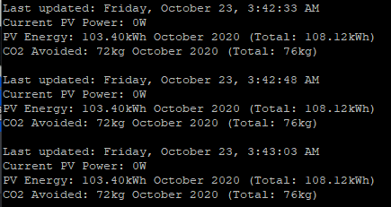

# SunnyPi
Display the SMA Sunny Portal on a Raspberry Pi e-ink display

Run the script with python3 SunnyPi.py

The terminal will output some information:

And the e-ink display will automatically refresh every 10 seconds:

